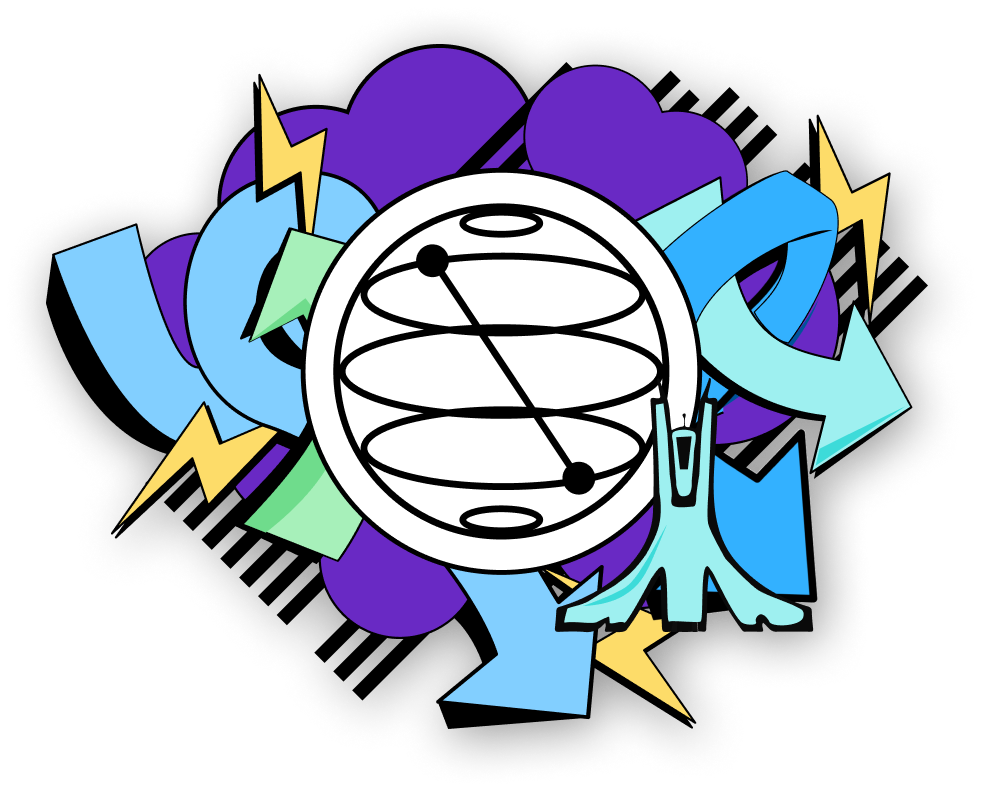

<!--
*** This the README file of our Qiskit-Fall-Fest-Algiers-2022 project.
-->

[![Contributors][contributors-shield]][contributors-url]
[![Stargazers][stars-shield]][stars-url]
[![Issues][issues-shield]][issues-url]
[![MIT License][license-shield]][license-url]
[![LinkedIn][linkedin-shield]][linkedin-url]

<!-- PROJECT LOGO -->
 

  

  <h3 align="center">Qiskit Fall Fest Algiers website</h3>

  

    this is the official repository for Qiskit Fall Fest Algiers website
     
     
     
    <a href="https://wtm-algiers-qiskit-2022-website-4dmt4jjg1-wtm-algiers.vercel.app/">View Demo</a>
    ·
    <a href="https://github.com/GDGAlgiers/gdg-algiers-website-2022/issues">Report Bug</a>
  

<!-- ABOUT THE PROJECT -->

## About The Project

[![Qiskit-Fall-Fest-Algiers-Home][qiskit-fall-fest-screenshot]](https://wtm-algiers-qiskit-2022-website-4dmt4jjg1-wtm-algiers.vercel.app/)

This is the official repository of Qiskit Fall Fest Algiers

### Built With

Technologies used to build the website:

- [![Next][next.js]][next-url]
- [![React][react.js]][react-url]
- [![tailwindcss][tailwindcss.com]][tailwindcss-url]

<!-- LICENSE -->

## License

Distributed under the No License. See `LICENSE` for more information.

<!-- CONTACT -->

## Contact

WTM Algiers - [@wtm_algiers](https://twitter.com/wtm_algiers) - wtm.algiers@esi.dz

Project Link: [qiskit-fall-fest-algiers.wtmalgiers.org](https://qiskit-fall-fest-algiers.wtmalgiers.org)

<!-- MARKDOWN LINKS & IMAGES -->

[contributors-shield]: https://img.shields.io/github/contributors/WTM-Algiers/wtm-algiers-qiskit-2022-website.svg?style=for-the-badge
[contributors-url]: https://github.com/WTM-Algiers/wtm-algiers-qiskit-2022-website/graphs/contributors
[stars-shield]: https://img.shields.io/github/stars/WTM-Algiers/wtm-algiers-qiskit-2022-website.svg?style=for-the-badge
[stars-url]: https://github.com/WTM-Algiers/wtm-algiers-qiskit-2022-website/stargazers
[issues-shield]: https://img.shields.io/github/issues/WTM-Algiers/wtm-algiers-qiskit-2022-website.svg?style=for-the-badge
[issues-url]: https://github.com/WTM-Algiers/wtm-algiers-qiskit-2022-website/issues
[license-shield]: https://img.shields.io/github/license/WTM-Algiers/wtm-algiers-qiskit-2022-website.svg?style=for-the-badge
[license-url]: https://github.com/WTM-Algiers/wtm-algiers-qiskit-2022-website/blob/main/LICENSE
[linkedin-shield]: https://img.shields.io/badge/-LinkedIn-black.svg?style=for-the-badge&logo=linkedin&colorB=555
[linkedin-url]: https://www.linkedin.com/company/wtm-algiers/
[qiskit-fall-fest-screenshot]: images/sectionsAssets/screenshot.png
[next.js]: https://img.shields.io/badge/next.js-000000?style=for-the-badge&logo=nextdotjs&logoColor=white
[next-url]: https://nextjs.org/
[react.js]: https://img.shields.io/badge/React-20232A?style=for-the-badge&logo=react&logoColor=61DAFB
[react-url]: https://reactjs.org/
[tailwindcss.com]: https://img.shields.io/badge/TailwindCSS-563D7C?style=for-the-badge&logo=TailwindCSS&logoColor=white
[tailwindcss-url]: https://tailwindcss.com
